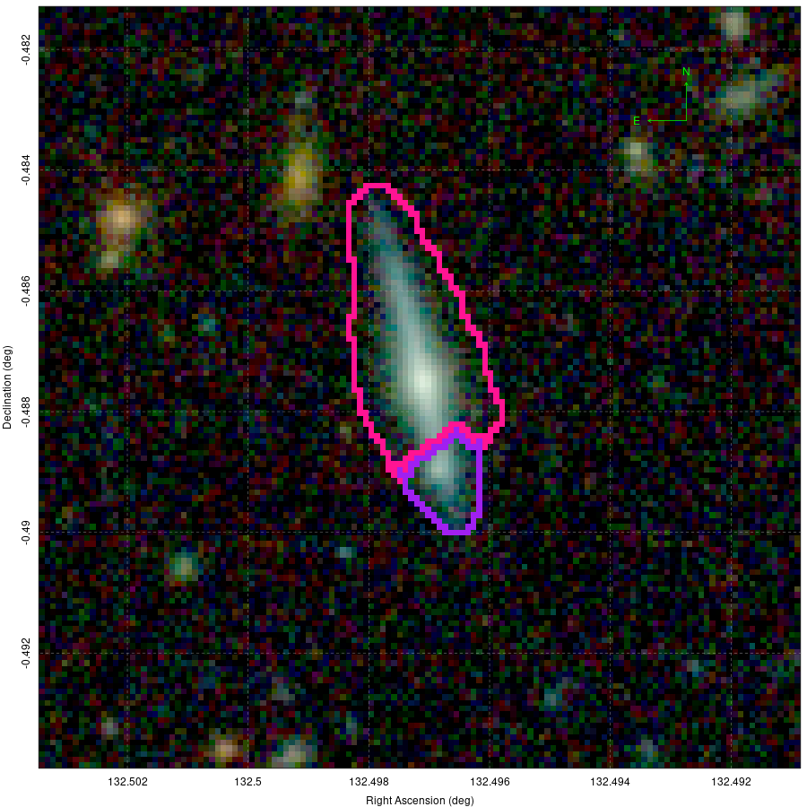
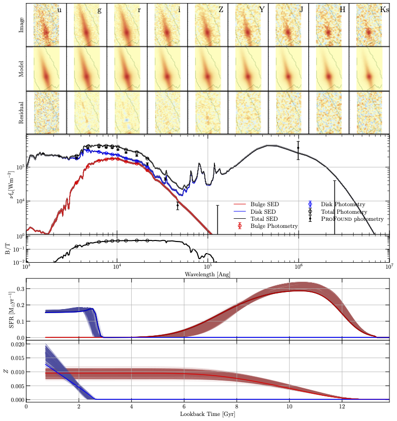

# ProFuse
**ProFound** + **ProFit** + **ProSpect** = **ProFuse**

This is the spectral spatial decomposition package **ProFuse** as discussed in Robotham+ 2022. This work was carried out in close collaboration with Sabine Bellstedt.

Below is an example GAMA RGB (Hig) colour image:



Which we then decompose the **ProFuse**, creating the following 9 band spectral spatial decomposition:



The key part here is that we now get separate star formation histories (SFHs) for our bulge and disk component, which when combined can be multi-modal, and much more complex than allowed with a uni-modal ProSpect SFH. In this case we find we form a very massive and old bulge, and a comparatively young disk which is actually brighter in all bands but contains less stellar mass. Even a traditional NIR decomposition would not have revealed our bulge as being more massive than our disk!

## Installation

If you are interested in trying **ProFuse** out then by all means have a try at installing this package. You will need a number of other packages first of course. First some lower-level (general purpose) things:

``` r
# install.packages("remotes")
remotes::install_github("asgr/magicaxis")
remotes::install_github("asgr/ParmOff")
remotes::install_github("asgr/cmaeshpc")
remotes::install_github("asgr/LaplacesDemon")
remotes::install_github("asgr/Highlander")
```

And now some of the core **ProTools** packages:

```r
remotes::install_github("asgr/celestial")
remotes::install_github("asgr/Rfits")
remotes::install_github("asgr/ProFound")
remotes::install_github("ICRAR/ProFit") #confusingly I do not host the production version!
remotes::install_github("asgr/ProSpect")
remotes::install_github("asgr/ProFuse")
```

I also strongly suggest that you check out my **ProFuse** vignette to get you going: https://rpubs.com/asgr/806303


Good luck! And feel free to get in touch with me / Sabine Bellstedt.
